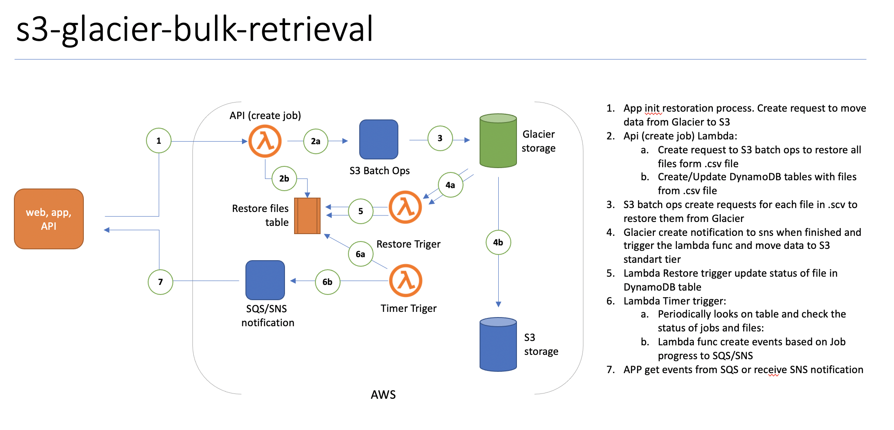

# S3 Glacier Bulk Retrieval

S3 batch operations can help you create bulk operations for object restore but it does not provide a mechanism of bulk finished events or retrieval progress. That module provides that functionality and you can create bulk operations to restore thousands of objects and just receive only a few events per bulk request. Currently, using S3 API you need to handle an event for each restored object independently and create logic to group these events in one transaction by yourself. To help in that situation that module encapsulates that logic of handling thousands of independent events in one bulk transaction and notify the external app via SNS event. Also, it provides notification of restoration progress based on a number of restored objects through SNS or SQS. 

That module provides described functionality below:
* HTTP API of creating a job  (/src/api)
* event handling of object restoration (/src/s3restore)
* DynamoDB tables to store jobs statuses and per object restoration status
* Asynchronous monitoring for the bulk restoration of objects including S3 batch ops and finalized events of moving objects from Glacier/Deep Archive to regular S3


Below is an example of a customer application that is using that module on the AWS side to restore data from Glacier. 

## Installation and setup
That solution is SAM application and  to build and deploy it you will need SAM CLI available [here](https://docs.aws.amazon.com/serverless-application-model/latest/developerguide/serverless-sam-cli-install.html) after installation you will need to do these steps:
1. Go to the folder where you place source code 
2. type in shell `sam init` and provide initial configuration and name for the app
3. type in the shell `sam build` that command will pack your app to package
4. type in the shell `same deploy` that command will deploy the app to AWS

## Authentication
API for creating a job is published through API gateway with key auth enabled. You can find here details on how to create authenticated HTTP request using key [here](https://docs.aws.amazon.com/apigateway/latest/developerguide/how-to-use-postman-to-call-api.html) To make a HTTP call you need to add HTTP header - `x-api-key:{api_key}`. You can find api_key in the API gateway console in "API KEYS" section. 

## Example of creating a job
To create a job you need to execute POST request to the endpoint that you can get from SAM deploy output. 
URL example: `https://xxxxxxx.execute-api.eu-west-1.amazonaws.com/prod/create-job`

with that json in POST body
```
{
    "bucket": "BUCKET_NAME",
    "key": "KEY",
    "tier": "STANDARD",
    "expiration_days": 1,
    "client_tag": "client_tag"
}
```

Parameters:
* bucket - bucket from your subscription where the manifest file for batch ops is placed
* key - folder and file name for the manifest. Manifest .csv should be in UTF8 format with CRLF. [Here](https://docs.aws.amazon.com/AmazonS3/latest/dev/batch-ops-basics.html#specify-batchjob-manifest) is format details.
* client_tag - we are using that value to tag operations for better cost exploration


output example

```
{
    “SNSTopic”: “arn:aws:sns:eu-west-1:273595204085:bulk-restore-SNSTopic-IDCFS0Z7OPWX”,
    “BulkJobId”: “82319eda-4945-4b83-84e4-b2cee06f57d0",
    “BatchOperation”: {
        “ResponseMetadata”: {
            “RequestId”: “57703ABF828F3987",
            “HostId”: “uUviEX1p4Ar9ZQ3hUv7PaIuUJpur9wePflwSzdm4IJMsVaIrXc1kMwxwPIUrcckyOfRC2VDq5zc=“,
            “HTTPStatusCode”: 200,
            “HTTPHeaders”: {
                “x-amz-id-2”: “uUviEX1p4Ar9ZQ3hUv7PaIuUJpur9wePflwSzdm4IJMsVaIrXc1kMwxwPIUrcckyOfRC2VDq5zc=“,
                “x-amz-request-id”: “57703ABF828F3987",
                “date”: “Wed, 21 Oct 2020 15:44:18 GMT”,
                “content-length”: “91",
                “server”: “AmazonS3"
            },
            “RetryAttempts”: 0
        },
        “JobId”: “8de3a7b5-fd0c-4b9d-ac43-b17995a836dc”
    }
}

```

Attributes:
* SNSTopic - To that topic would be published bulk events. you need to subscribe to that SNS topic. You can find more information on how to subscribe to SNS topics [here](https://docs.aws.amazon.com/sns/latest/api/API_Subscribe.html) 
* BulkJobId - Id of our bulk operation. You will receive events linked to that id in the SNS topic
* BatchOperation - that's the response from S3 Batch ops request for information.

## Recieving events
To receive the event of finished restoration bulk operation you will need to subscribe to SNS topic that you received in the initial creating job request. To subscribe to a topic you can use API described [here](https://docs.aws.amazon.com/sns/latest/api/API_Subscribe.html). Here you can see an example of an event message:

```
{
   "JobId":"bc7dcf63-2262-4af9-899f-789c4a8c7292",
   "BatchJobId":"02de6cf4-baf9-4c22-b190-9b2a07910faf",
   "Status":"Restoring",
   "ProgressPercent":"54",
   "FailedBatchFiles":"0"
}
```

or 

```
{
   "JobId":"bc7d2263-1562-4af9-899f-789c4a8c7292",
   "BatchJobId":"02de22f4-baf9-4c69-b190-9b2a07910faf",
   "Status":"Complete",
   "ProgressPercent":"100",
   "FailedBatchFiles":"0"
}
```

or

```
{
   "JobId":"6437bb22-a0cb-4cfb-a286-29924e279c2e",
   "BatchJobId":"b477e19d-7338-4ec1-9343-b0d2e2f2e3e9",
   "Status":"Cancelled",
   "ProgressPercent":"0",
   "FailedBatchFiles":"0"
}
```

Attributes:
* **JobId**: id of restoration job, It's not S3 batch ops job id.
* **BatchJobId**: that's a corresponded S3 Batch Job Id. Using it you can find additional information about a batch job. 
* **Status**: Cancelled| Failed | Complete | Timeout | Restoring
* **ProgressPercent**: percent of restored files 
* **FailedBatchFiles**: number of files that were excluded from restoring  S3 batch ops operation. more details the reason you can find in the detailed report generated by Batch Ops operation by BatchJobID

## Security

See [CONTRIBUTING](CONTRIBUTING.md#security-issue-notifications) for more information.

## License

This library is licensed under the MIT-0 License. See the LICENSE file.
